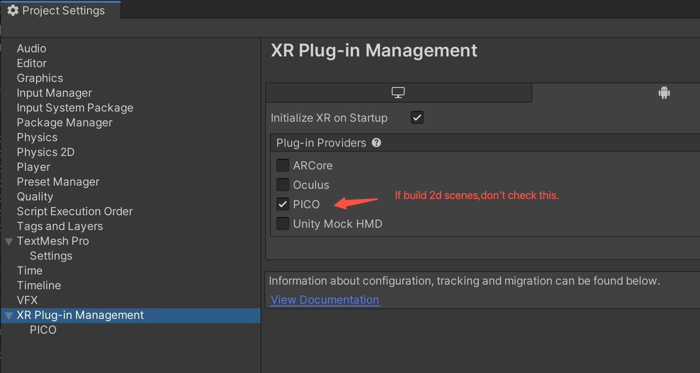
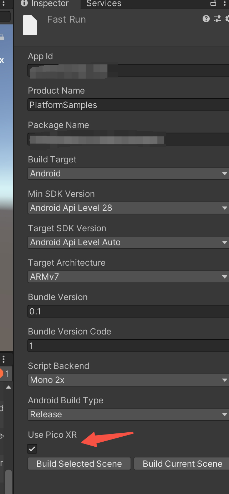

This repo contains samples demonstrating the usage of the Platform SDK. These demos are 2d demos.

# Requirement

| Environment          | Version    |
|----------------------|------------|
| Unity Editor         | &ge;2020.3 |
| Pico Integration SDK | &ge;2.1.2  |
| Pico ROM             | &ge;4.6.0  |

# SampleList

| Sample                  | Scene Type | Module | Description                                                                       |
|-------------------------|------------|--------|-----------------------------------------------------------------------------------|
| UserDemo                | 2D         | User   | Show the account,friends API usage.                                               |
| PresenceDemo            | 2D         | Social | Show the friends,presence API usage.                                              |
| InviteDemo              | 3D         | Social | A 3D Demo for presence inviting API usage.                                        |
| RtcDemo                 | 2D         | RTC    | Show the RTC API usage.                                                           |
| Challenges              | 2D         | Game   | Show the challenge API usage.                                                     |
| GameAPITest             | 2D         | Game   | Show the room,matchmaking,achievement,leaderboard API usage.                      |
| RoomAndMatchmakingEntry | 2D         | Game   | Show the room,matchmaking API usage.                                              |
| IAP                     | 3D         | IAP    | Show the IAP API usage.You can view the products and purchase products in an app. |
| IAP/DLC                 | 3D         | DLC    | Show the DLC API usage.                                                           |
| RtcMessage              | 2D         | RTC    | SendRoomMessage/SendUserMessage/SendStreamSyncInfo.                               |

| SmallRTC                | 2D         | RTC    | The minimized demo to use RTC.                                                    |
| SportCenter             | 2D         | Sport  | Show the API usage to communicate with the SportCenter.                           |

# How to run 2D demos ?

To use system input method,some demos are 2D scenes.  
When you build 2D scenes,you should goto menu `ProjectSettings/XR` and uncheck the PICO plugin.  

We provided a `fast run` menu in this sample,you can uncheck the `Use Pico XR` toggle to build 2D scenes.

# Note

* Use the old InputSystem rather than the new input system.  