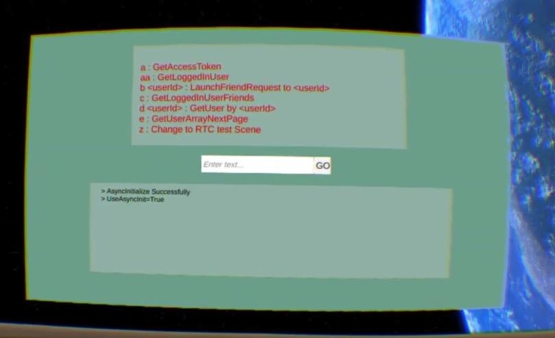
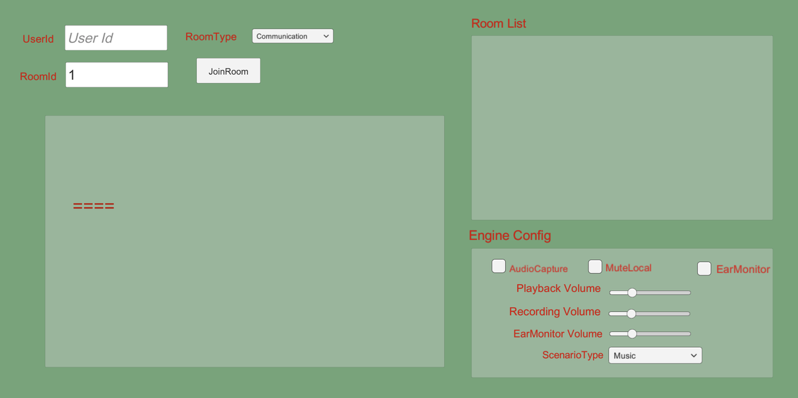
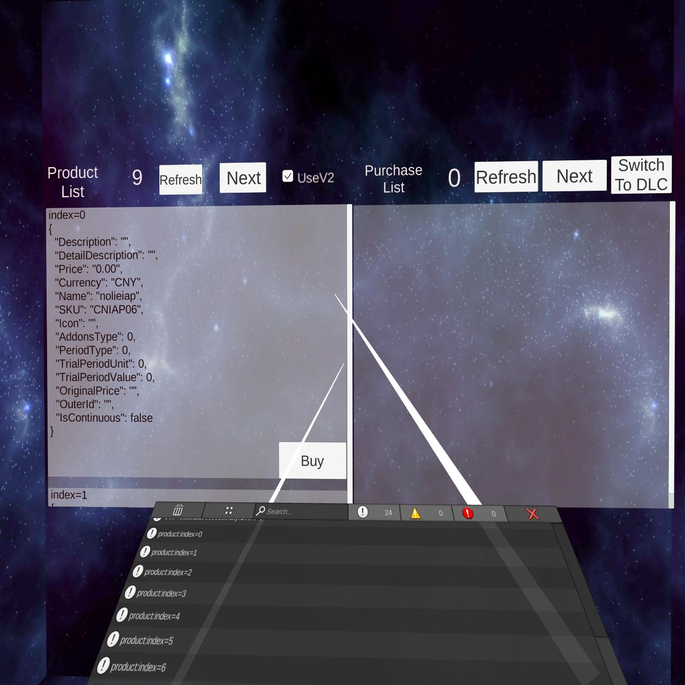
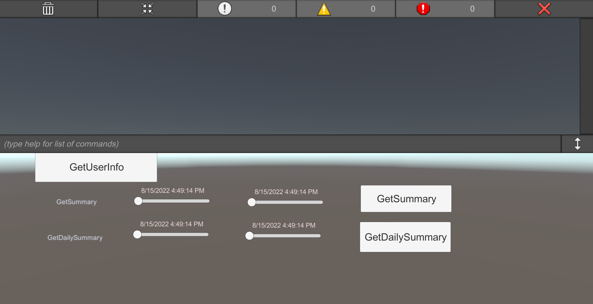

PICO Integration SDK is the main SDK for PICO development.It consists of XR SDK and Platform SDK.   
This repo contains samples demonstrating the usage of the Platform SDK.

# Requirement

| Environment          | Version             |
|----------------------|---------------------|
| Unity Editor         | &ge;2020.3 &le;2021 |
| Pico Integration SDK | &ge;2.1.5           |
| Pico ROM             | &ge;5.4.0           |

# SampleList

| Sample                  | Module&Doc                                                                                                        | Description                                                                       |
|-------------------------|-------------------------------------------------------------------------------------------------------------------|-----------------------------------------------------------------------------------|
| AsyncSimpleDemo         | [Core](https://developer-global.pico-interactive.com/document/unity/instructions-on-using-platform-service-apis/) | Show the async/await style API usage.                                             |
| UserDemo                | [User](https://developer-global.pico-interactive.com/document/unity/accounts-and-friends/)                        | Show the account,friends API usage.                                               |
| PresenceDemo            | [Social](https://developer-global.pico-interactive.com/document/unity/interaction/)                               | Show the friends,presence API usage.                                              |
| InviteDemo              | [Social](https://developer-global.pico-interactive.com/document/unity/interaction/)                               | A 3D Demo for presence inviting API usage.                                        |
| RtcDemo                 | [RTC](https://developer-global.pico-interactive.com/document/unity/rtc/)                                          | Show the RTC API usage.                                                           |
| Challenges              | [Challenge](https://developer-global.pico-interactive.com/document/unity/challenges/)                             | Show the challenge API usage.                                                     |
| GameAPITest             | [Game](https://developer-cn.pico-interactive.com/document/unity/leaderboard/)                                     | Show the room,matchmaking,achievement,leaderboard API usage.                      |
| RoomAndMatchmakingEntry | [Room](https://developer-global.pico-interactive.com/document/unity/matchmaking/)                                 | Show the room,matchmaking API usage.                                              |
| IAP                     | [IAP](https://developer-global.pico-interactive.com/document/unity/in-app-purchase/)                              | Show the IAP API usage.You can view the products and purchase products in an app. |
| IAP/DLC                 | [DLC](https://developer-global.pico-interactive.com/document/unity/downloadable-content/)                         | Show the DLC API usage.                                                           |
| RtcMessage              | [RTC](https://developer-global.pico-interactive.com/document/unity/rtc/)                                          | SendRoomMessage/SendUserMessage/SendStreamSyncInfo.                               |
| RtcStream               | [RTC](https://developer-global.pico-interactive.com/document/unity/rtc/)                                          | Publish/UnPublish RTC Stream.                                                     |
| SmallRTC                | [RTC](https://developer-global.pico-interactive.com/document/unity/rtc/)                                          | The minimized demo to use RTC.                                                    |
| SportCenter             | [Sport](https://developer-global.pico-interactive.com/document/unity/exercise-data-authorization/)                | Show the API usage to communicate with the SportCenter.                           |

We will introduce some example in the below.  

UserDemo has three part. The first part shows the command and function. The second part is the input area. The last part shows the result of the function. 

Before using RTC demo,you should enable RTC service in [the developer center](https://developer-cn.pico-interactive.com/console). Input the userId,roomId and click `JoinRoom` button. The user id can be decide by yourself,such as '1'.   
After joined room,click the `Publish` button in the roomList. And enable `AudioCapture` in the `EngineConfig` area. If another person is in the same room, he/she can hear from you.  

IAP demo has two part. The left is the product list. The right part is the purchased product list. 

The sport center module has three methods：`GetUserInfo`、`GetSummary`、`GetDailySummary`. The `SportCenter` demo shows can be used to call these API and get results.

