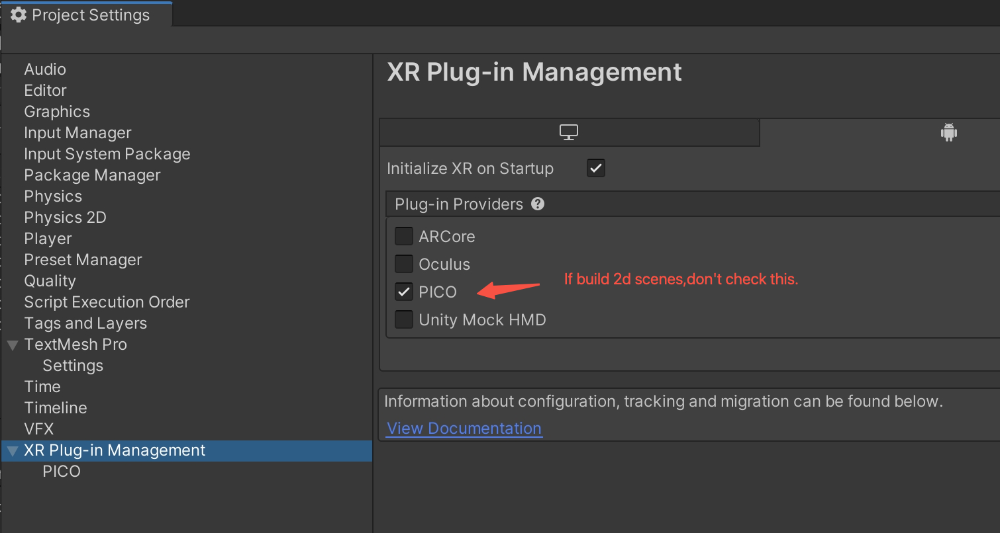

This repo contains samples demonstrating the usage of the Platform SDK. These demos are 2d demos.

# Requirement

| Environment          | Version    |
|----------------------|------------|
| Unity Editor         | &ge;2019.4 |
| Pico Integration SDK | &ge;2.1.1  |
| Pico ROM             | &ge;4.6.0  |

# SampleList

| Sample                                                    | Scene Type | Module | Description                                                                    |
|-----------------------------------------------------------|------------|--------|--------------------------------------------------------------------------------|
| UserDemo/UserDemo                                         | 2D         | User   | Show the account,friends,presence API usage.                                   |
| RtcDemo/RtcDemo                                           | 2D         | RTC    | Show the RTC API usage.                                                        |
| Game/GameAPITest /GameAPITestScene                    | 2D         | Game   | Show the RTC API usage.                                                        |
| Game/RoomAndMatchmakingEntry /RoomAndMatchmakingEntry | 2D         | Game   | Show the RTC API usage.                                                        |
| IAP/IAP                                                   | 3D         | IAP    | Show the IAP API usage.You can view the products and purchase products in an app. |
| IAP/DLC                                                   | 3D         | DLC    | Show the DLC API usage.                                                        |
| RtcMessage/RtcMessage                                     | 2D         | RTC    | SendRoomMessage/SendUserMessage/SendStreamSyncInfo.                            |
| RtcTokenWillExpire                                        | 2D         | RTC    | Verify the token expiration behavior.                                          |
| RtcUserStream                                             | 2D         | RTC    | Control RTC stream.                                                            |
| SmallRTC/SmallRTC                                         | 2D         | RTC    | The minimized demo to use RTC.                                                 |
| SportCenter/SportCenter                                   | 2D         | Sport  | Show the API usage to communicate with the SportCenter.                        |

# How to run 2D demos ?

Some demos are used to show API usage so they are 2D demos.  
When you build 2D scenes,you should goto menu `ProjectSettings/XR` and uncheck the PICO plugin.  

# Note

* Use the old InputSystem rather than the new input system.  